# Teamwork
## A Realm Mobile Platform Example Application

  
  

## Intro

This is an app designed to showcase a larger-scale collaborative example using the Realm Mobile Platform (RMP) and the Realm Object Server (ROS).

### Overview

This app demonstrates stripped down yet concrete implementation of app that might be used by a distributed, collaborative mobile workforce.
The model is that of a centrally managed but mobile services operation - such as might be found in a power company, a cable company, sales/operations teams, etc.

Some of the goals for this app are:

1. Ability to have 1 or more "manager" role users and an arbitrary number of workers/remote operators.

1. Ability for "manager" role owners to create work items ("tasks") and assign them to "workers."  These tasks can have:

    - A title
    - A location which defines a specific place the task is to be performed
    - A due-date for the task
    - A completed date (the date a task was marked as done)
    - A team to which this task is assigned.  If not assigned to a specific team it's a "free floating" task.
    - An assigned worker/field agent who is tasked with "completing" this task - if not assigned to a specific worker, yet is assigned to the team it's a "team task" that can be worked on by any team member (these distinctions show up in the various views of tasks).

1. Ability to have workers receive new tasks that show up in their list of assigned tasks.

1. Ability for completed tasks to be reflected in a assigning manger's work list.

1. Ability for a manager user to have a map that shows the location of  assigned tasks or last-known locations of workers assigned to tasks.

1. Ability for field agent to see a map of all tasks

# Installation

## Prerequisites

This app uses [Cocoapods](https://www.cocoapods.org) to set up the project's 3rd party dependencies. Installation can be directly (from instructions at the Cocapods site) or alternatively through a package management system like [Homebrew](brew.sh/).

### Realm Mobile Platform

This application demonstrates features of the [Realm Mobile Platform](http://lrealm.io) and needs to have a working instance of the Realm Object Server available to make tasks, and other data available between instances of the TeamWork app. The Realm Mobile Platform can be downloaded from [Realm Mobile Platform](http://realm.io) and exists in two forms, a ready-to-run macOS version of the server, and a Linux version that runs on RHEL/CentOS versions 6/7 and Ununtu as well as several Amazon AMIs and Digital Ocean Droplets. The macOS version can be run with the TeamWork right out of the box; the Linux version will require access to a Linux server.

### 3rd Party Modules

The following modules will be installed as part of the Cocoapods setup:

 - [ActionSheetPicker](https://github.com/skywinder/ActionSheetPicker-3.0) for selection of dates by Petr Korolev

 - [BTNavigationDropdownMenu](https://github.com/realm-demos/BTNavigationDropdownMenu) a dropdown menu for UINavigationBar by Pham Ba Tho

 - [Eureka](https://github.com/xmartlabs/Eureka) a formbuilder for iOS in Swift by xmartlabs

 - [ImagePicker](https://github.com/hyperoslo/ImagePicker.git) for selection of photo library images by Hyper.no

 - [ISHHoverBar](https://github.com/iosphere/ISHHoverBar.git) a floating control for an action bar on top of MapKit views by iosphere GmbH

 - [JVFloatLabeledTextField](https://github.com/jverdi/JVFloatLabeledTextField) a company combined UILabel/UITextfield control by Jared Verdi

 - [PermissionScope](https://github.com/nickoneill/PermissionScope.git) permission management dialog by Nick O'Neill

## Preparing the Realm Object Server

The TeamWork application can be used with any version of the Realm Object Server (Developer, Professional or Enterprise).  The TeamWork app needs to be able to set permissions on the Realm used by the app - this must be done by a Realm user that has permission/rights to administer the server.  This could be the first account you set up as part of the Realm Object Server installation, or any account that has the admin bit set.

You can determine which accounts have admin rights by logging in to the Realm Object Server Dashboard:

You create new users (and give them admin rights) on this screen.

You can set the admin rights for existing users by clicking-through to the user's profile page and checking the "can administer this server" checkbox:

Once you have created or selected an admin user to use, you can proceed with compiling and running TeamWork.

## Compiling & Running the Application

Before attempting to compile the project, install all of its dependencies using Cocoapods by invoking ``pod install``. This is done by opening a Terminal window and changing to the directory where you downloaded the TeamWork repository. In this main directory is a Folder called `TeamWork` that contains `Podfile` needed by `CocoaPods` as well as the application sources.

This process will create a ``Pods`` directory which contains all of the compiled resources needed by the app, along with an Xcode xcworkspace file which you will open and work with instead
of the `TeamWork.xcproject` file when building/running this application.

Once the cocoapods have been retrieved, open the ``TeamWork.xcworkspace`` file and press build.  The app should compile cleanly.

### First Login

As mentioned above, the first login to the TeamWork app needs to be by a user enabled with administrative privileges on the Realm Object Server.  This is to enable a global Read/Write permission on the shared Realm that is created by the application.

### Adding Users

Adding users can be done either via the Realm Dashboard, or by adding users using the TeamWork the app itself from the login screen.

 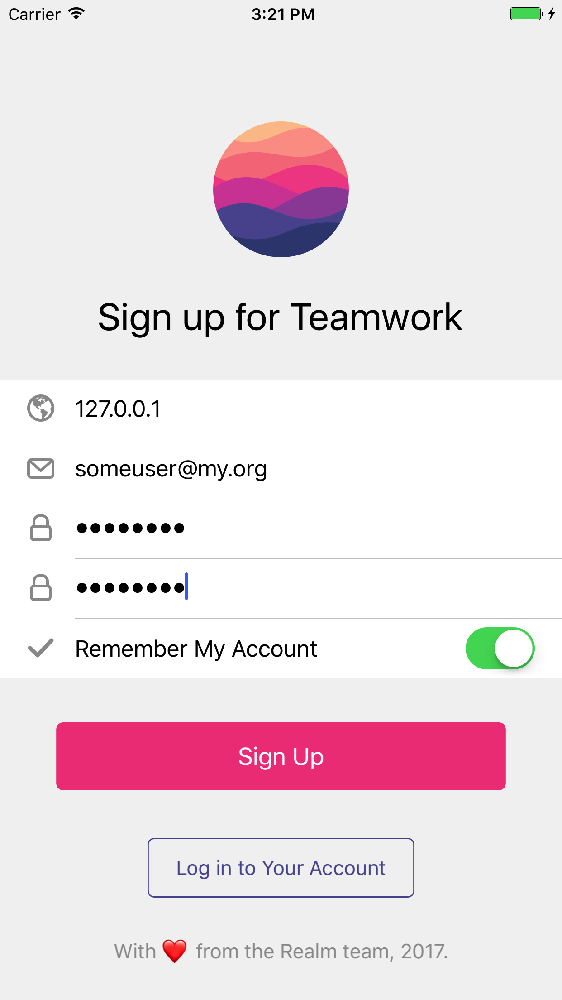
 

## Navigating TeamWork
The TeamWork app is a classic "tab bar" application - that is to say it supports a number of main views that are accessible at all times:

 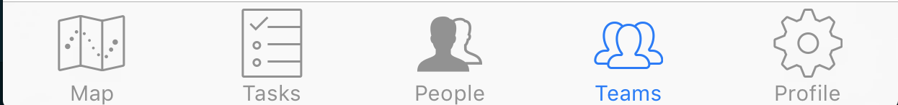 Tab Bar
  

These are:

 * A Map view
 * A Tasks List - for Admins the default is a listing of al tasks in the system; a pull down menu (available to all users) lists available teams.  Selecting a team makes it the default team view and will change what the map view displays.
 * A Teams List - Admins create/edit teams as well as see all teams; regular users can see teams they are on.
 * A list of people in the system (this view is restricted to user with a "manager" role)
 * A Profile view where personal details (name, profile image) can be set

### App Permissions
After logging in, when TeamWork first launches it will ask for permission to access your camera, photo library and for the ability to user your location.  These permissions allow the app to set an Avatar image, and to show where users are on the main map.  No information is shared with 3rd parties or kept anywhere else but the Realm in which the TeamWork's data is stored.

 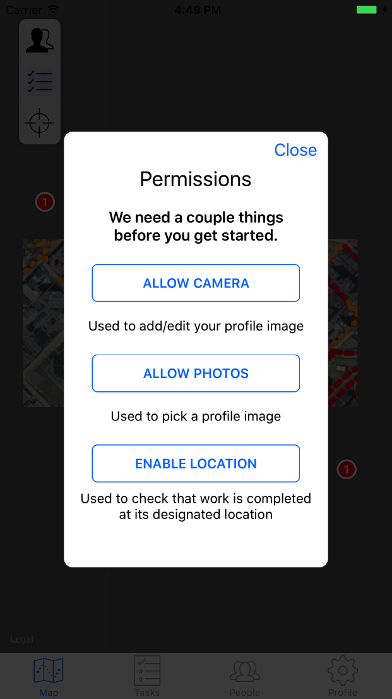 Permissions
 

### The Main Map View

 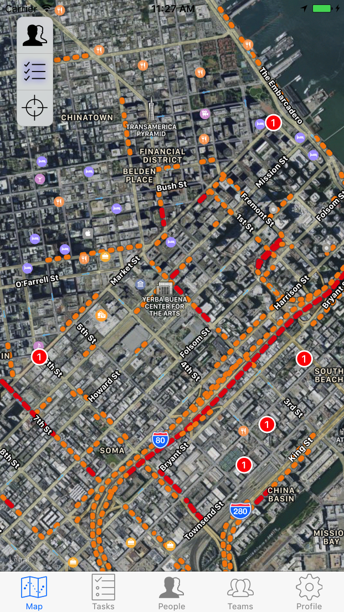 Task Map - Manager's View
 

The centerpiece of the app for both managers and field workers is the Map View - this view shows all of the current yet-to-be-completed tasks in the system.  For managers it shows _all tasks_, while for field workers it will only show tasks assigned to that worker.

The map supports clustering - this means if there are a number of tasks close to each other, and the map is "zoomed out" far enough, the map will cluster nearby tasks and denote the number of tasks the cluster contains.

Tapping the cluster will tell you the number of tasks in the cluster but if the cluster contains "1" task tapping will reveal basic information about the task:

 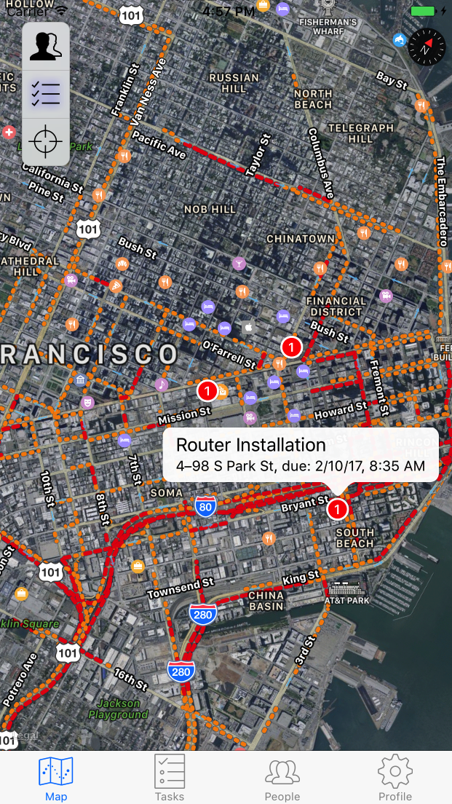 Task Map with Detail
 

If your map shows clusters of tasks you can double-tap or "pinch-to-zoom" in and the map will re-draw as needed to reveal more information.

# The Task List & Task Details

The task list shows the tasks assigned to a given field worker, or, if the user has the "manager" role, then all tasks will be displayed.  Tapping on a tasks will reveal the task detail screen.  Managers (as shown here) have the ability to edit tasks by tapping the "Edit" button.

   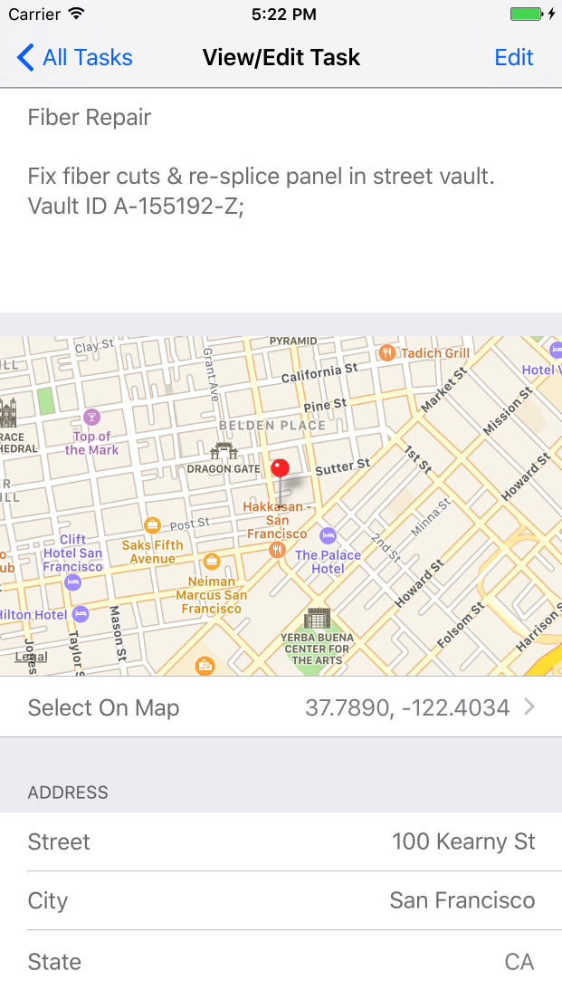 Tasks - Manager's View
 

alternatively a specific team vuew can be selected:

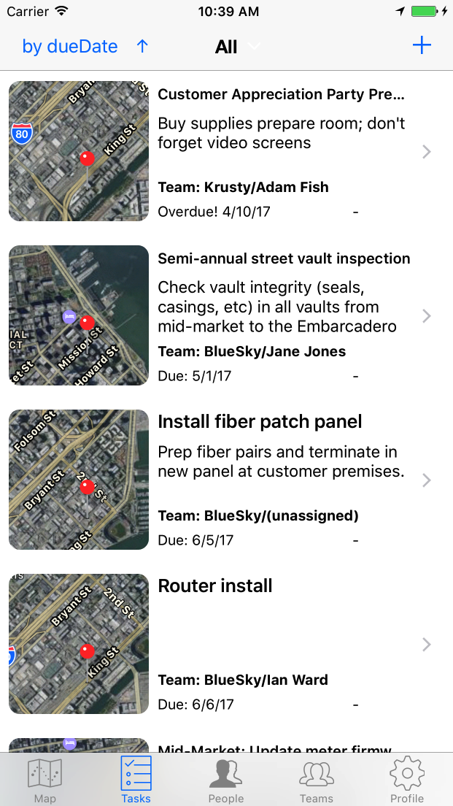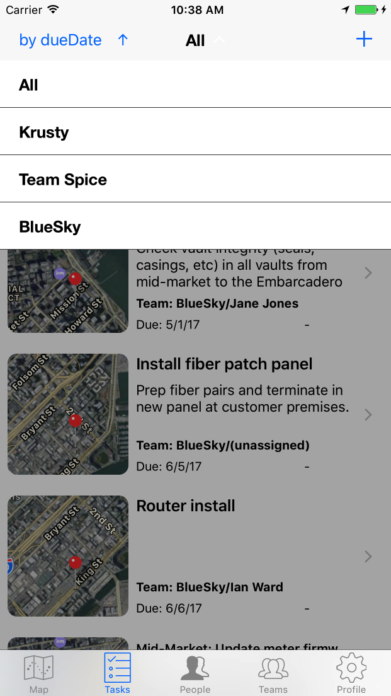 Task Vew Selection 

## New Task Creation

Managers can create new tasks. These have a title, a detail description and can be assigned a work location by either typing an address, or directly by manipulating the map to find the desired location. Scrolling to the bottom of the task editor (not shown in this screen shot) it is possible to assign a due date, team and/or a specified field worker to accomplish the task.

 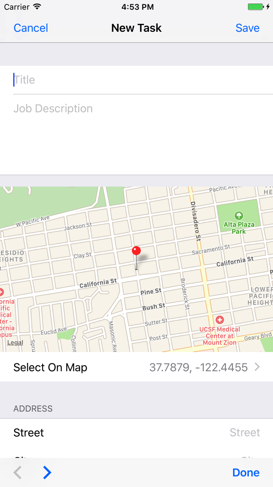 New Task Entry
 

## Team list

Teamwork supports the concept of Teams.  A team can have as many members as needed; people can also be on multiple teams.

 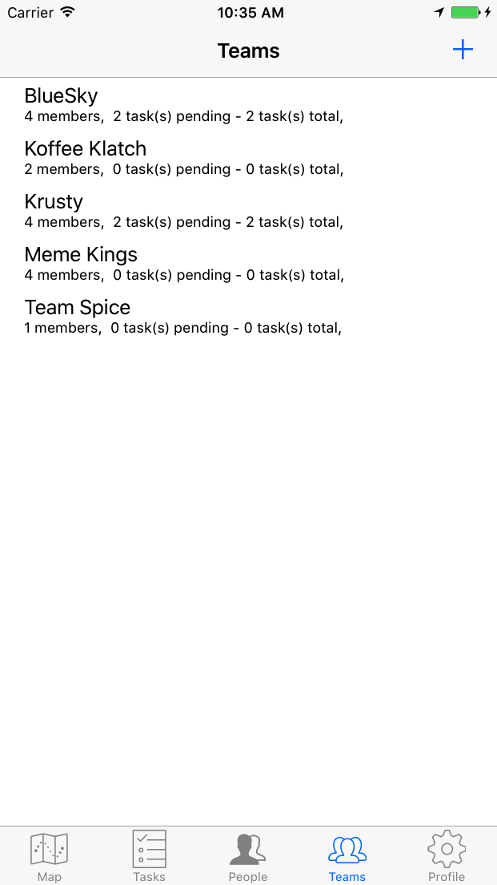 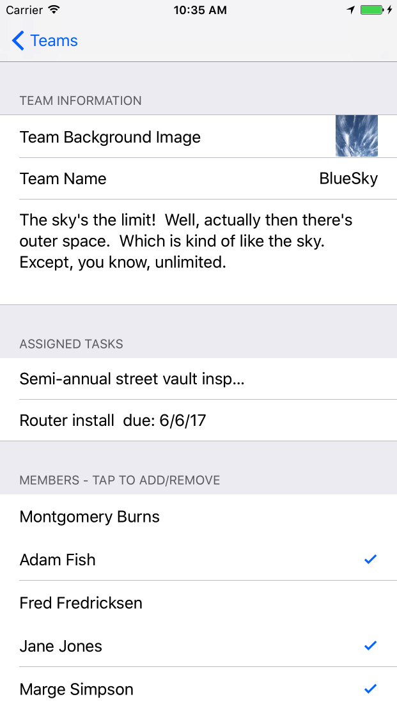 Teams and Task/Team Assignment   

The team assignments are also reflected in the tasks list where the team and/or team member assigned is shown in the summary:

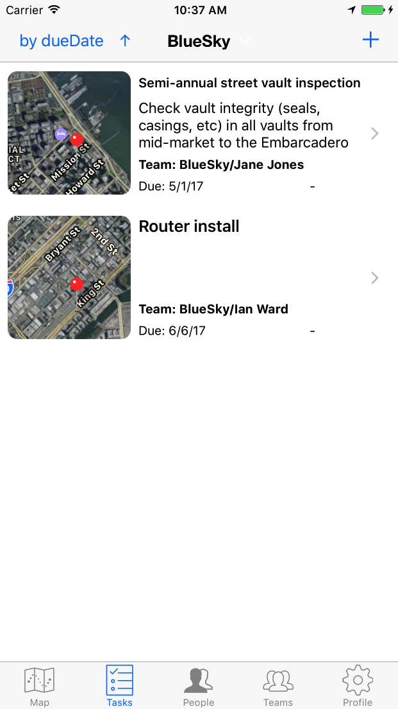

## People List and Detail

Another manager feature is the ability to look at all the people in the TeamWork system and get a capsule summary of their upcoming and overdue tasks.

 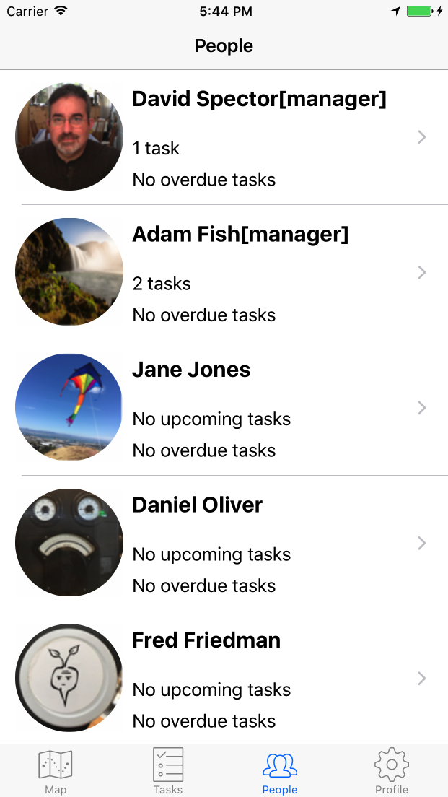 Person Detail View
 

Tapping on the record for a person will reveal detail about that person's assigned tasks (and tapping further into an individual tasks will reveal that task's details, and so on).

 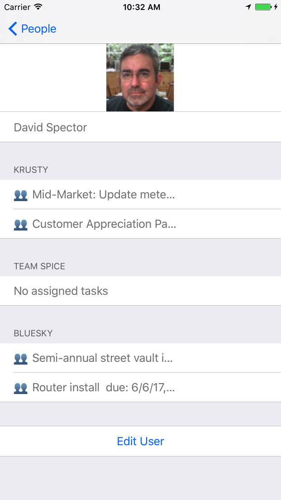 Person Detail View
 

# Application Architecture

TeamWork implements an idealized model that describes the the basic types needed to implement a field service type  application:
 
 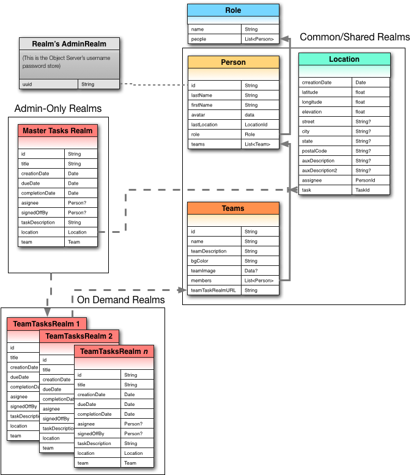 TeamWork Models
 

The basic architecture describes 3 business entities and a role mechanism:

 - The *Person* model describes all users of the system; since Realm itself is agnostic on user meta data (it tracks only the authentication info - username and password) this class is here to allow the application to add more color to the user's profile (name, profile image), as well as to map the role of the user to what they do inside the system (admin, manager or worker).

 - The *Task* model is the crux of the system - it's the stuff that needs to be done. Tasks are, of course, done by people and usually have to be done at a specified place and completed by a specified time. The properties of this model cover both the basics of describing a task and allows for the task to be tied to a given person who will be responsible for fulfilling it and the place where the work is to be done.

 The tasks _model_ is used twice - once for the master tasks list which is accessible to admin users where tasks are created and then assigned, and again in _Team Task Lists_ which support copies of tasks visible and actionable by the teams to which specific tasks are assigned.

 - The *Location* model serves two purposes - it's objects will be linked to the location where a a task needs to be performed, but it also allows the locations of field workers to be recorded.   The logic of the app, providing the user has granted access for location services, will create a single location object per user and updated that whenever the user has the app open.   The end result is that managers can use the map view to see both the locations of tasks pending completion, as well as the last-known locations of field workers.

- The *Role* model implements an application specific system for deciding who can see what objects inside TeamWork. This is something application specific, so Realm does not impose any hardcoded defaults on how your app and your users data access should be managed.  Here in TeamWork _manager_ users are effectively "super users" who can see all tasks, other users and can create or modify any object in the system, while "workers" are limited to seeing only their own  assigned tasks.

- The *Teams* model implements an index Realm for Admin/Manager users where they can create and manage

These simple models are composed into a multi-Realm system that looks like this:

 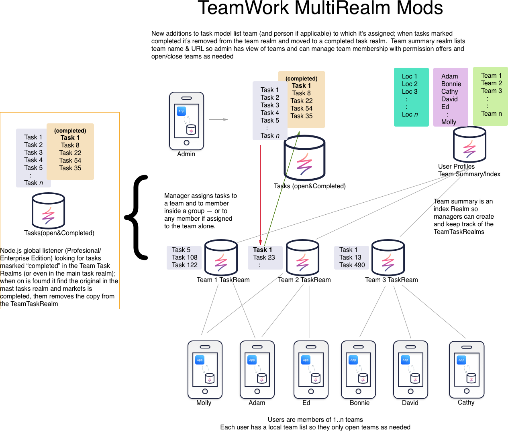 TeamWork Model Overview
 

## The Admin/Manager Model/Realm Flow

 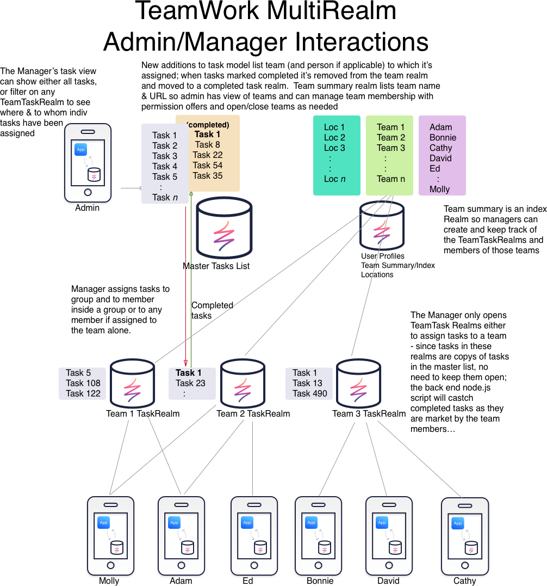 TeamWork Admin/Manager  Flow
 

## The Worker model/Realm Flow

 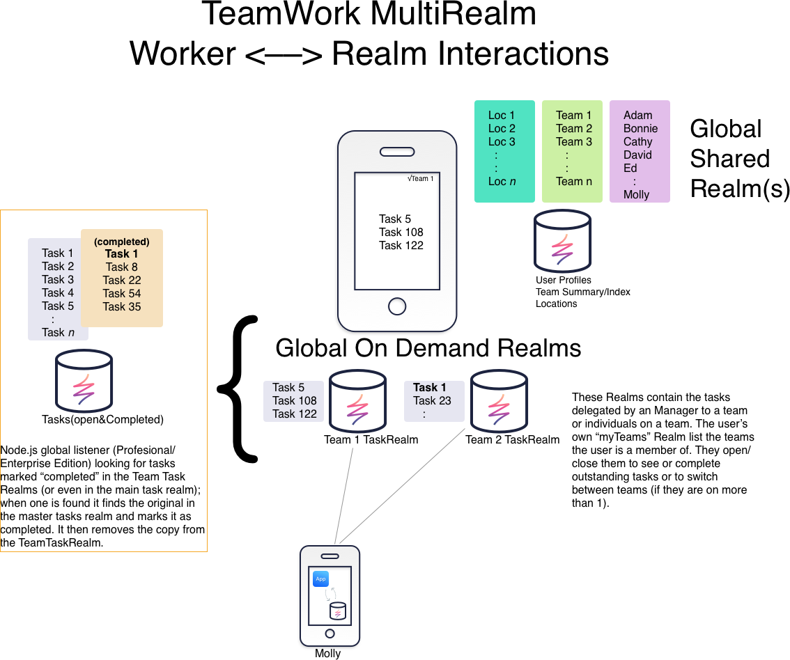 TeamWork Worker Models
 

### Limitations

TeamWork is (_clearly_) not designed to be a full-blown field services / logistics management application; but it does show the power of the Realm Mobile Platform to allow application developers to focus on the core business problems in their application, rather than the minutiae of infrastructure and differences between mobile platform implementations.

The fact that these three very limited models have the ability to express the key business drivers of such as user management, task creation assignment, tasks/user location visualization, display of on-time/late services delivery, etc  shows that the Realm Mobile Platform can greatly accelerate the development of mobile apps while simultaneously reducing app complexity.  The alternative -- which is the status-quo today -- is developing not just the business logic of your app, but in fact all of the data delivery mechanics of data synchronization, data integrity, conflict resolution and so on ...right down to the hardware layer not just for your infrastructure but every mobile platform your app runs on.

Other issues and limitations are described in the GitHub Issues page for this repo.

 ## Contributing

See [CONTRIBUTING.md](CONTRIBUTING.md) for more details!

This project adheres to the [Contributor Covenant Code of Conduct](https://realm.io/conduct/). By participating, you are expected to uphold this code. Please report unacceptable behavior to [info@realm.io](mailto:info@realm.io).

## License

Distributed under the Apache 2.0 license. See [LICENSE](LICENSE) for more information.

